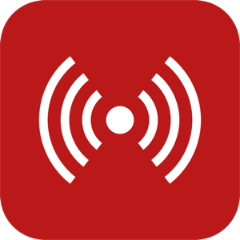
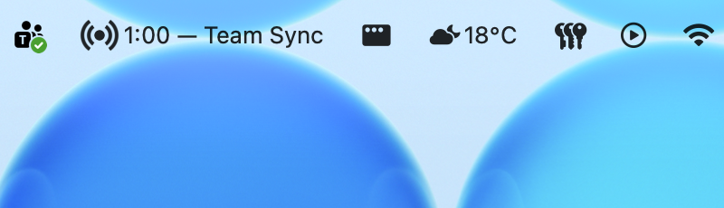

  

# MeetingTune

**MeetingTune** is a desktop app that plays your chosen tune before meetings and shows a live countdown so you're never caught off guard. The tune isn't just a reminder — it's a vibe shift. That last minute before a meeting doesn't have to feel like dread; MeetingTune fills it with a track that gets your head in the game so you show up energised and ready.

  

## Download

| Platform | Architecture | Download |
|----------|-------------|----------|
| macOS | Apple Silicon (M1/M2/M3/M4) | [MeetingTune-1.0.0-arm64.dmg](https://github.com/nickattack97/meetingtune/releases/latest/download/MeetingTune-1.0.0-arm64.dmg) |
| macOS | Intel (x64) | [MeetingTune-1.0.0-x64.dmg](https://github.com/nickattack97/meetingtune/releases/latest/download/MeetingTune-1.0.0-x64.dmg) |
| Windows | x64 | [MeetingTune-Setup-1.0.0-x64.exe](https://github.com/nickattack97/meetingtune/releases/latest/download/MeetingTune-Setup-1.0.0-x64.exe) |

## Installation

### macOS
1. Download the `.dmg` for your architecture above.
2. Open the `.dmg` and drag **MeetingTune** to your Applications folder.
3. Launch MeetingTune — grant **Calendar** access when prompted on first launch.

### Windows
1. Download `MeetingTune-Setup-1.0.0-x64.exe` above.
2. Run the installer and follow the on-screen instructions.
3. Launch **MeetingTune** from your desktop or Start Menu.

## Requirements

- **macOS**: 12 Monterey or later, Xcode Command Line Tools (for Calendar helper — installed automatically on first launch)
- **Windows**: Windows 10 or later, Microsoft 365 / Exchange account for calendar access

## License

© 2026 MeetingTune. All rights reserved.
